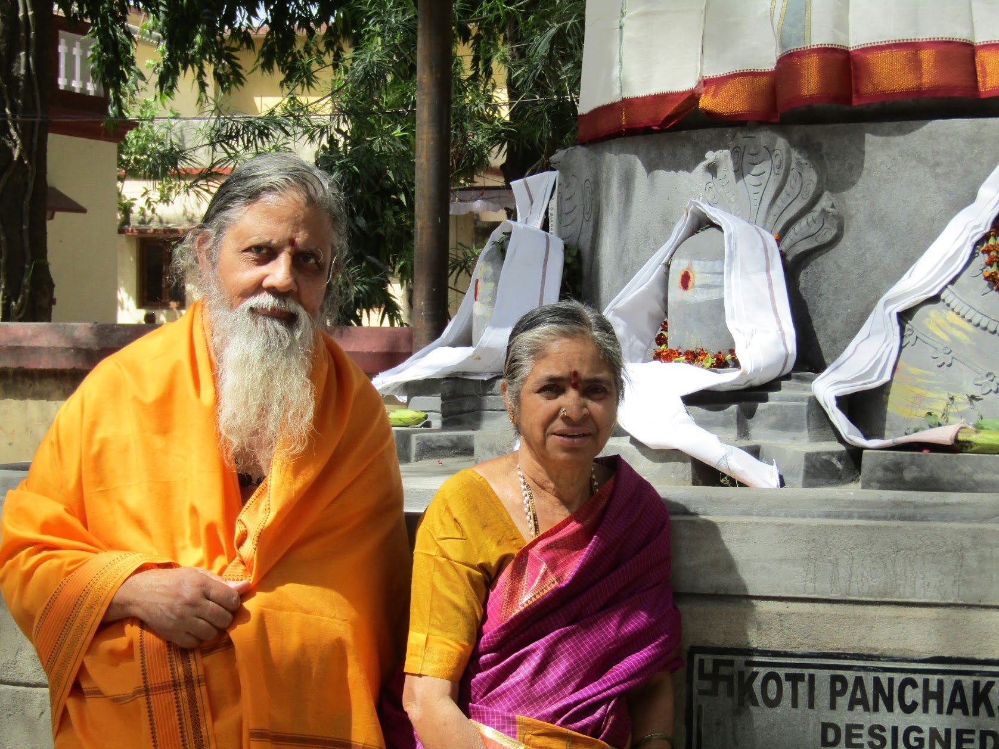

# **శ్రీపాదుక ఆచార్య కొల్లూరు అవతారశర్మ**  
## **భార్య:** శ్రీమతి కొల్లూరు వెంకటరమణమ్మ
(భాషాప్రవీణ, రాష్ట్రభాషాప్రవీణ, సంస్కృతభాషాకోవిద, యం.ఏ., తెలుగు)  

## **జననీ జనకులు:** స్వర్గీయ కొల్లురు లక్శ్మీసోమిదమ్మ, స్వర్గీయ కొల్లురు లక్శ్మణమూర్తిశర్మ
(ఆంధ్రవిశ్వవిద్యాలయ స్వర్ణపతాకగ్రహీత, న్యాయ మీమాంసాలంకార వేదాంతశాస్త్ర పండితులు)

